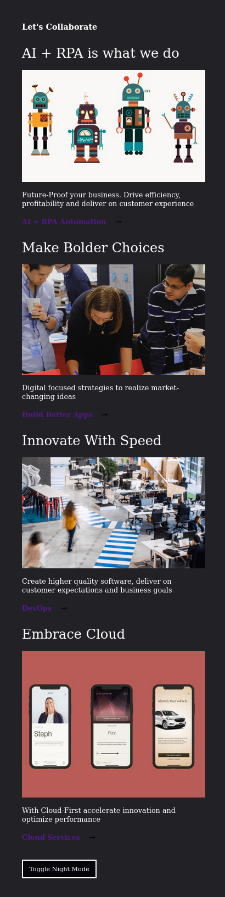
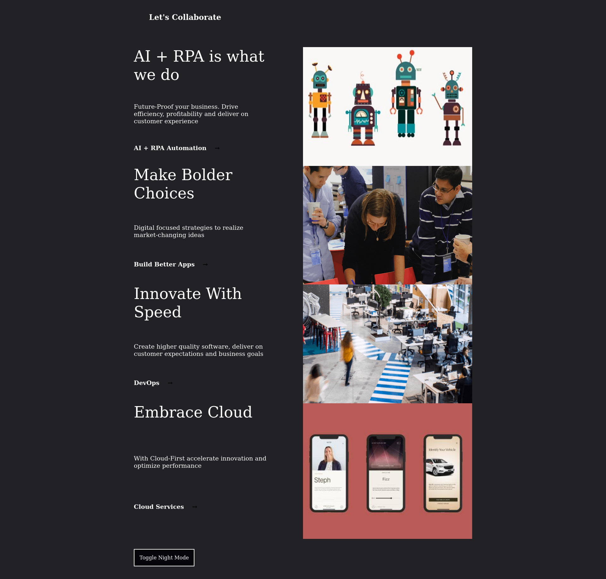
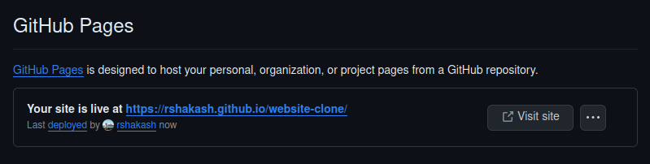

# website-clone
A clone of the website: https://lets-collab-rust.vercel.app/

## Day 1: Set Up and Structure
### Steps
1. Created a github repo with a readme.md file

2. Add remote repo to the local folder
3. Downloaded images from the original website to the assets folder
4. Add screenshots folder to track changes in appearance of website
5. Create a .json file to contain website data
6. Add a html, css and js file

### Folder Structure

Note:- .gitignore file has been removed

### Code Overview
- Mobile first approach
- Flexbox used for mobile screens
- Grid used for desktop screens
- Using javascript to insert the html with the data parsed by content.json

### Site screenshot after day 1
#### Mobile Screens

#### Desktop Screens

## Day 2: Toggling Dark Mode
### Code Overview
1. Add a class 'dark-mode' in main.css
2. Add a 'click' event listener to the toggle mode button
3. Invert the color and background element of the body element whenever the click event occurs
4. Only invert the color of links element when the viewport width is grater than 720px

### Site screenshot after day 2
#### Mobile Screens

## Day 3: Website Deployment
This repository is currently deployed on Github Pages. 
[Live Site URL](https://rshakash.github.io/website-clone/)

### Screenshot of deployment
