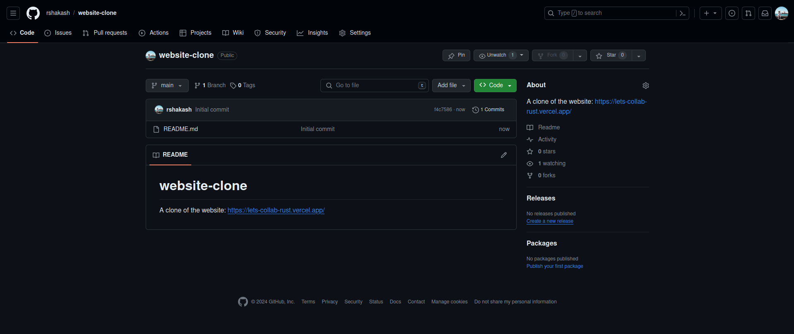
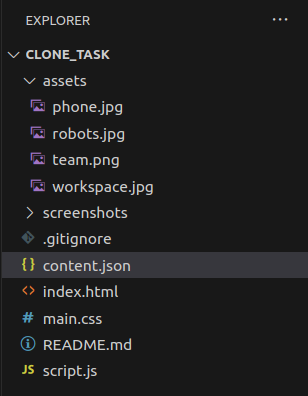
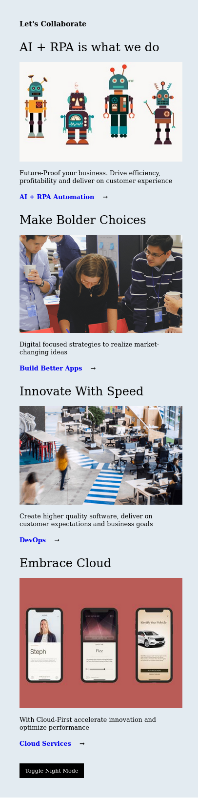
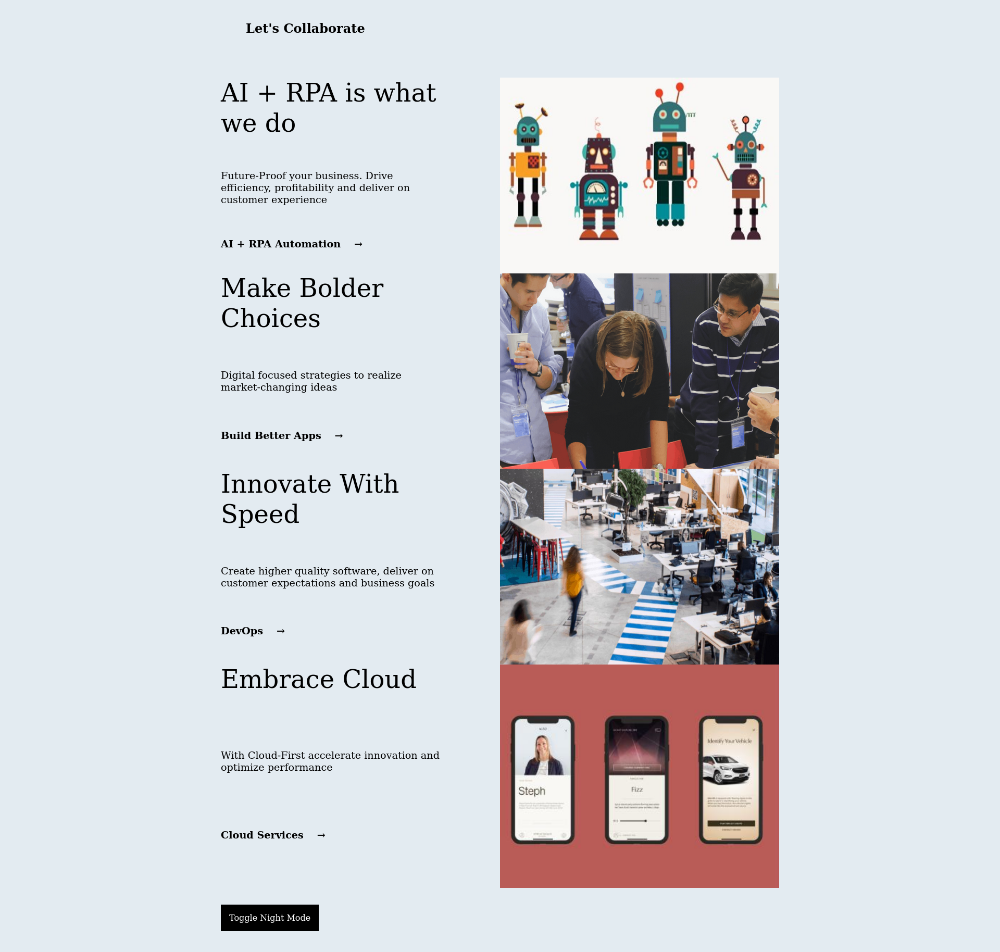

# website-clone
A clone of the website: https://lets-collab-rust.vercel.app/

## Day1
### Steps
1. Created a github repo with a readme.md file

2. Add remote repo to the local folder
3. Downloaded images from the original website to the assets folder
4. Add screenshots folder to track changes in appearance of website
5. Create a .json file to contain website data
6. Add a html, css and js file

### Folder Structure

### Overview of CSS code
- Mobile first approach
- Flexbox used for mobile screens
- Grid used for desktop screens

### Site screenshot after day 1
#### Mobile Screens

#### Desktop Screens
